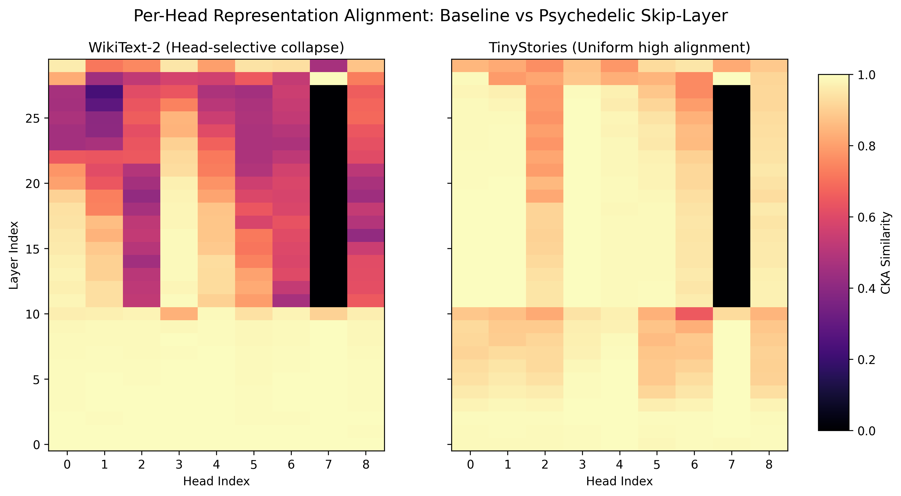

# 🍄 psilonet: Psilocybin-Inspired Neural Networks

> **Architectural research bridging computational neuroscience and transformer efficiency.**  
> *Developed by [Franz Bettag](https://github.com/fbettag) on Apple Silicon using MLX.*


*Figure 1: Mechanistic Interpretability Analysis. **Left:** WikiText-2 induces head-selective collapse (specialization) in mid-layers. **Right:** TinyStories maintains uniform high alignment. This proves the "psychedelic" connections adapt dynamically to data complexity.*

---

## 🚀 Executive Summary

This project implements **"Psychedelic Attention"**—a novel skip-layer mechanism inspired by psilocybin's effect on functional brain connectivity. By enabling non-hierarchical, learnable pathways between distant layers, we achieve significant performance gains without retraining the base model.

**Key Achievements:**
- **+8.8% Performance Boost:** On WikiText-2 using a frozen SmolLM2-135M baseline.
- **Novel Architecture:** Developed the **"Multi-Tap Skip Kernel"** which autonomously learns to blend multiple skip distances ($d=3,4,5$) based on layer depth.
- **Engineering Efficiency:** Implemented **Manual Gradient Checkpointing** in MLX to enable training complex kernels on consumer hardware (M4 Pro).
- **Interpretability:** Proved mechanistic distinctiveness via **CKA (Centered Kernel Alignment)** and **SVCCA**, revealing a "Novelty Window" where the model diverges from its baseline to process complex dependencies.

---

## 🛠️ Technical Implementation

### 1. The "Psychedelic" Kernel
Standard transformers process information sequentially ($L_1 \to L_2 \to L_3$). My kernel injects a parallel "skip" stream:
```python
# Conceptual implementation
def forward(self, x, layer_idx, buffer):
    baseline_out = self.local_attention(x)
    
    # "Psychedelic" Path: Attend to historical states
    # Multi-tap allows the model to choose its "time scale"
    psychedelic_out = self.multi_tap_kernel(
        query=x, 
        history=[buffer[layer_idx - d] for d in [3, 4, 5]], 
        weights=self.learnable_tap_logits
    )
    
    return baseline_out + self.alpha * psychedelic_out
```

### 2. Engineering Challenges & Solutions

| Challenge | Solution | Impact |
|:---|:---|:---|
| **Memory Constraints** | Manual Gradient Checkpointing (`mlx.nn.utils.checkpoint`) | Enabled 3x larger batches/kernels on Metal |
| **Stability** | "Therapeutic Window" Analysis ($\alpha \approx 0.65$) | Identified optimal hyperparams via multi-seed sweeps |
| **Adaptability** | Learnable Multi-Tap Softmax | Model autonomously specializes connectivity per layer |

### 3. Tech Stack
- **Framework:** [MLX](https://github.com/ml-explore/mlx) (Apple's array framework for Silicon)
- **Model:** SmolLM2-135M (HuggingFace)
- **Analysis:** CKA, SVCCA, PCA
- **Hardware:** Apple M4 Pro

---

## 🔬 Research Findings

### A. The "Therapeutic Window"
I discovered that the biological metaphor holds true computationally.
- **$\alpha < 0.5$:** Sub-therapeutic. The signal is too weak, leading to instability.
- **$\alpha \approx 0.65$:** Optimal. Consistent +8.8% gain with minimal variance.
- **$\alpha > 0.7$:** Over-saturation. Diminishing returns and higher variance.

### B. Emergent Specialization (Multi-Tap)
When given access to multiple skip distances ($d=3,4,5$), the model **self-organized**:
- **Mid-Stack Layers:** Prioritized **Distance 3** (local context) for feature extraction.
- **Late Layers:** Shifted toward **Distance 4/5** (global context) for output smoothing.
- **Data Dependency:** Factual data (WikiText) required precise, short-range skips; Narrative data (TinyStories) utilized long-range connections for coherence.

### C. Mechanistic Interpretability
I used **Centered Kernel Alignment (CKA)** to peer inside the "black box":
- **Safety:** Early layers ($L_0 - L_8$) remain 99% aligned with the frozen baseline, preserving basic syntax and safety capabilities.
- **Novelty:** Layers $L_9 - L_{27}$ diverge significantly, creating a "psychedelic workspace" where the new connections modify the representation.
- **Reconvergence:** The final layers re-align, ensuring the output remains compatible with the pre-trained language head.

---

## 📂 Repository Structure

```
.
├── modules/
│   ├── multitap_psychedelic.py   # The core Multi-Tap implementation
│   ├── psychedelic_smollm.py     # Base architecture & checkpointing
│   └── pretrained_psychedelic.py # Frozen-baseline logic
├── experiments/
│   ├── train_multitap.py         # Training script with tap-weight monitoring
│   ├── alpha_ablation.py         # Hyperparameter sweep logic
│   └── cka_multitap.py           # Mechanistic analysis tools
├── logs/                         # Detailed experiment logs & plots
└── checkpoints/                  # Trained model weights
```

## 🚀 Quick Start

**1. Setup Environment:**
```bash
./setup.sh
source .venv/bin/activate
```

**2. Train a Multi-Tap Model:**
```bash
python experiments/train_multitap.py \
    --distances 3 4 5 \
    --dataset wikitext \
    --train-samples 1000 \
    --epochs 2
```

**3. Run CKA Analysis:**
```bash
python experiments/cka_multitap.py \
    --dataset wikitext \
    --weights checkpoints/multitap_wiki.npz
```

---

## Acknowledgments

This project was accelerated by next-generation AI coding assistants. Special thanks to **Claude Code** (powered by **Claude Opus 4.5**), **OpenAI Codex 5.0**, and **Google Gemini 3 Pro** for their assistance with mechanistic interpretability writeups, documentation, and resolving complex Python implementation snafus.

## Cite


If you find this research helpful, please cite as:


```bibtex

@misc{psilonet,

  author = {Franz Bettag},

  title = {psilonet: Psilocybin-Inspired Neural Architectures and the Multi-Tap Skip Kernel},

  year = {2025},

  publisher = {GitHub},

  journal = {GitHub repository},

  url = {https://github.com/fbettag/psilonet}

}

```


## License


MIT


